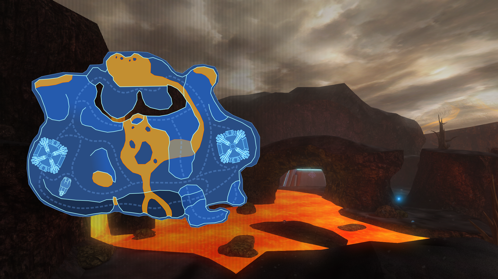

# Halo CE - Ashes

This is my first completed halo CE map. This project was started years ago, even before the release of the MCC on PC with its new and improved Mod Tools. 
It was an attempt to see how far I could push myself with design, modeling, texturing. The map has gone through many changes as it was being worked on.
Some changes were due to artistic choice and some changes were necessary to mitigate to the engine limitations I was discovering along the way.
After a couple years of abandonment, it saw new life thanks to the release of the Mod Tools; I had decided to resurrect it and finally finish it once and for all.

The map uses custom geometry, custom texture and shaders, custom sounds and custom particle effects.
However it does not feature any new mechanics, weapons or characters, as I wanted to keep the classic Halo feel as much as possible.
## Lore

Installation 01 is a distant, forgotten and dangerous place. It's descovery, by scientist Robin Hale, sparked an insatiable interest to explore the surface.
Radio scans turned out to be inconclusive, as the thick atmosphere that surrounds the seemingly deserted ring has proven almost impenetrable. 
A group of Spartans was sent to investigate. However, they realized a little too late that the ashy, corrosive air was too distructive for the ships they used to reach the surface.
## Modes

Best suited for 2 to 8 players.

Supported game modes:
- Slayer
- Capture the Flag
- King of the Hill
- Oddball

Unsupported game modes:
- Race

## Main Menu
#### Map Name
>Ashes

#### Map Description
>It's hot down here... 2-8 players. Created by: alleluso

#### Map Thumbnail

#### Map Loading Screen

## Screenshots

